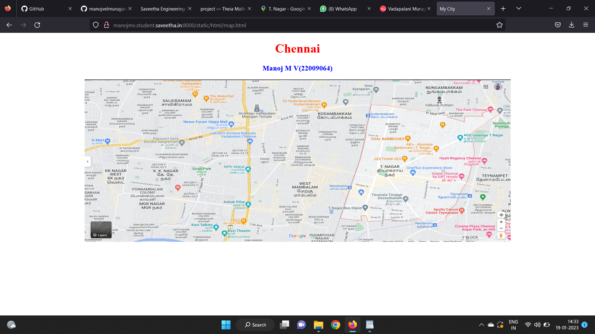
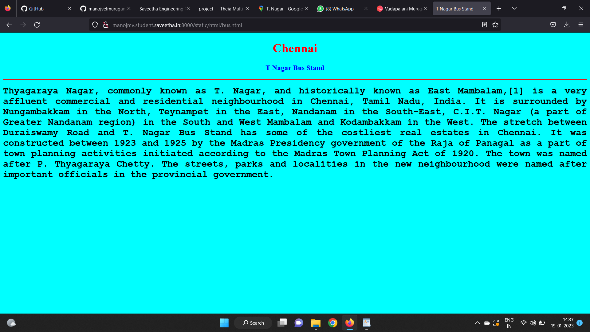
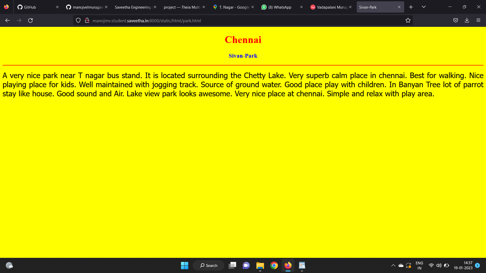
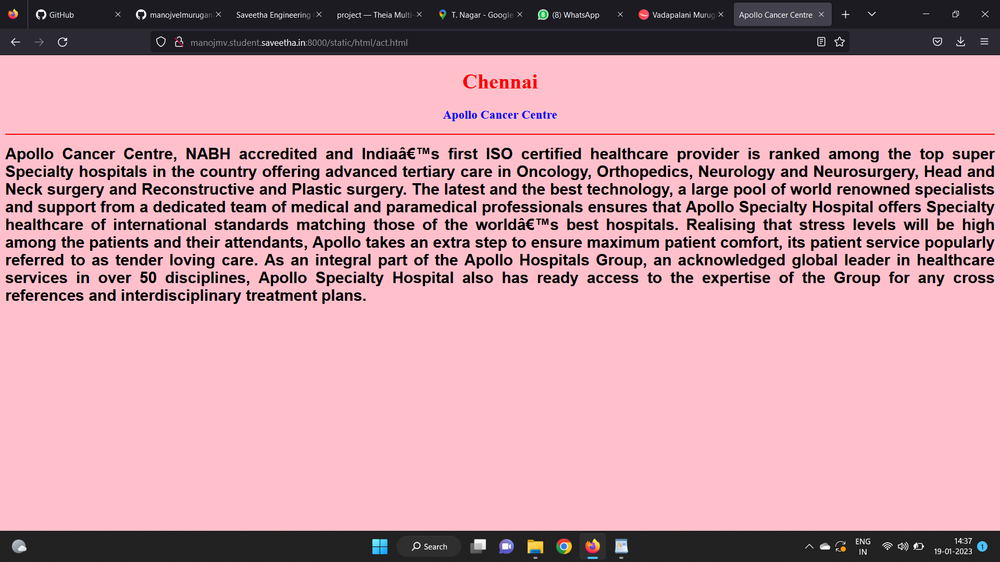
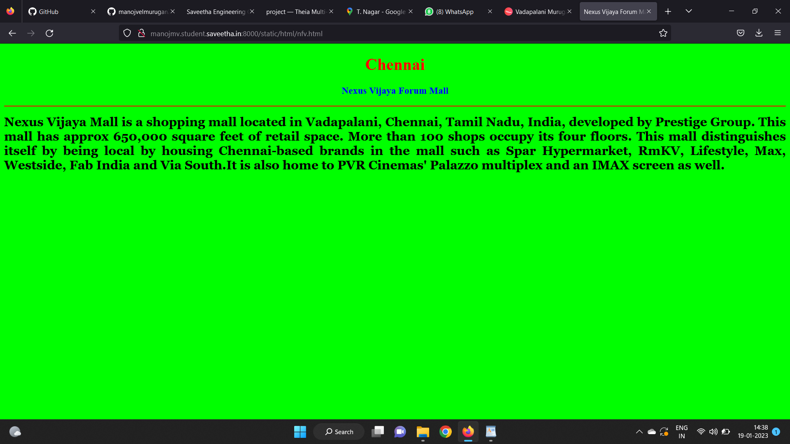
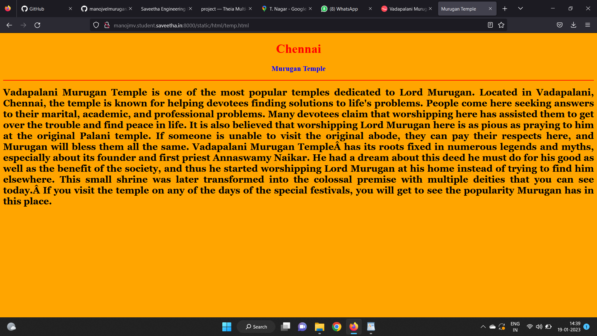
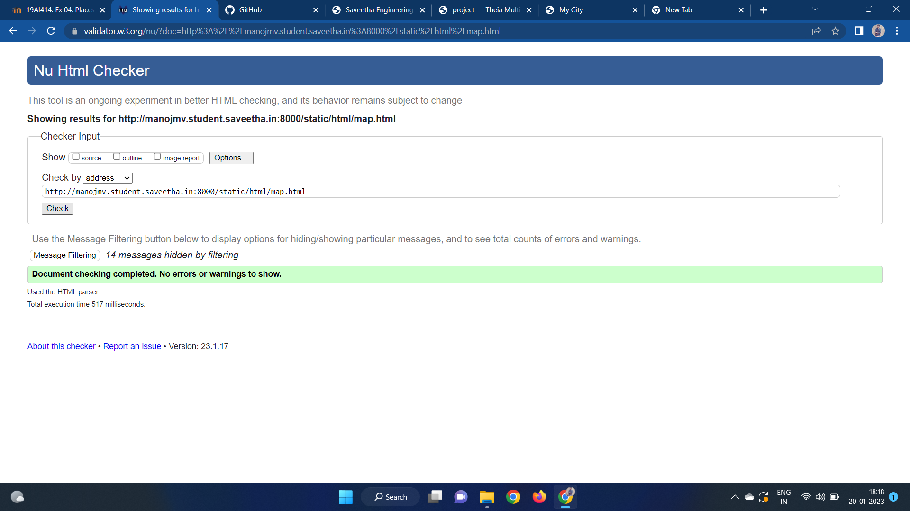

# Places Around Me
## AIM:
To develop a website to display details about the places around my house.

## Design Steps:

### Step 1:
Clone the github repository into Theia IDE.

### Step 2:
Create a new Django project

### Step 3:
Write the needed HTML code.

### Step 4:
Run the Django server and execute the HTML files.

## Code:
```
map.html
<!DOCTYPE html>
<html lang="en">
<head>
<title>My City</title>
</head>
<body>
<h1 align="center">
<font color="red"><b>Chennai</b></font>
</h1>
<h3 align="center">
<font color="blue"><b>Manoj M V(22009064)</b></font>
</h3>
<center>

<map name="MyCity">
<area shape="circle" coords="190,50,20" href="/static/html/nfv.html" title="Nexus Forum Vijaya Mall">
<area shape="rectangle" coords="230,30,260,60" href="/static/html/act.html" title="Apollo Cancer Centre">
<area shape="circle" coords="400,350,50" href="/static/html/temp.html" title="Murugan Temple">
<area shape="circle" coords="400,200,75" href="/static/html/bus.html" title="T Nagar Bus Stand">
<area shape="rectangle" coords="490,150,870,320" href="/static/html/park.html" title="Sivan-Park">
</map>
</center>
</body>
</html>

bus.html
 <!DOCTYPE html>
<html lang="en">
<head>
<title>T Nagar Bus Stand</title>
</head>
<body bgcolor="cyan">
<h1 align="center">
<font color="red"><b>Chennai</b></font>
</h1>
<h3 align="center">
<font color="blue"><b>T Nagar Bus Stand</b></font>
</h3>
<hr size="3" color="red">
<p align="justify">
<font face="Courier New" size="5">
<b>
Thyagaraya Nagar, commonly known as T. Nagar, and historically known as East Mambalam,[1] is a very affluent commercial and residential neighbourhood in Chennai, Tamil Nadu, India. It is surrounded by Nungambakkam in the North, Teynampet in the East, Nandanam in the South-East, C.I.T. Nagar (a part of Greater Nandanam region) in the South and West Mambalam and Kodambakkam in the West. The stretch between Duraiswamy Road and T. Nagar Bus Stand has some of the costliest real estates in Chennai. It was constructed between 1923 and 1925 by the Madras Presidency government of the Raja of Panagal as a part of town planning activities initiated according to the Madras Town Planning Act of 1920. The town was named after P. Thyagaraya Chetty. The streets, parks and localities in the new neighbourhood were named after important officials in the provincial government. 
</b>
</font>
</p>
</body>
</html>

park.html
<!DOCTYPE html>
<html lang="en">
<head>
<title>Sivan-Park</title>
</head>
<body bgcolor="yellow">
<h1 align="center">
<font color="red"><b>Chennai</b></font>
</h1>
<h3 align="center">
<font color="blue"><b>Sivan-Park</b></font>
</h3>
<hr size="3" color="red">
<p align="justify">
<font face="Tahoma" size="5">
A very nice park near T nagar  bus stand. It is located surrounding the Chetty Lake. 
Very superb calm place in chennai. Best for walking. Nice playing place for kids.
Well maintained with jogging track. Source of ground water.
Good place play with children.  In Banyan Tree lot of parrot stay like house. 
Good sound and Air. Lake view park looks awesome.
Very nice place at chennai.
Simple and relax with play area.
</font>
</p>
</body>
</html>

act.html
<!DOCTYPE html>
<html lang="en">
<head>
<title>Apollo Cancer Centre</title>
</head>
<body bgcolor="pink">
<h1 align="center">
<font color="red"><b>Chennai</b></font>
</h1>
<h3 align="center">
<font color="blue"><b>Apollo Cancer Centre</b></font>
</h3>
<hr size="3" color="red">
<p align="justify">
<font face="Arial" size="5">
<b>
Apollo Cancer Centre, NABH accredited and India’s first ISO certified healthcare provider is ranked among the top super Specialty hospitals in the country offering advanced tertiary care in Oncology, Orthopedics, Neurology and Neurosurgery, Head and Neck surgery and Reconstructive and Plastic surgery. The latest and the best technology, a large pool of world renowned specialists and support from a dedicated team of medical and paramedical professionals ensures that Apollo Specialty Hospital offers Specialty healthcare of international standards matching those of the world’s best hospitals. Realising that stress levels will be high among the patients and their attendants, Apollo takes an extra step to ensure maximum patient comfort, its patient service popularly referred to as tender loving care.

As an integral part of the Apollo Hospitals Group, an acknowledged global leader in healthcare services in over 50 disciplines, Apollo Specialty Hospital also has ready access to the expertise of the Group for any cross references and interdisciplinary treatment plans.
</b>
</font>
</p>
</body>
</html>

nfv.html
<!DOCTYPE html>
<html lang="en">
<head>
<title>Nexus Vijaya Forum Mall</title>
</head>
<body bgcolor="lime">
<h1 align="center">
<font color="red"><b>Chennai</b></font>
</h1>
<h3 align="center">
<font color="blue"><b>Nexus Vijaya Forum Mall</b></font>
</h3>
<hr size="3" color="red">
<p align="justify">
<font face="Georgia" size="5">
<b>
Nexus Vijaya Mall is a shopping mall located in Vadapalani, Chennai, Tamil Nadu, India, developed by Prestige Group. This mall has approx 650,000 square feet of retail space. More than 100 shops occupy its four floors. This mall distinguishes itself by being local by housing Chennai-based brands in the mall such as Spar Hypermarket, RmKV, Lifestyle, Max, Westside, Fab India and Via South.It is also home to PVR Cinemas' Palazzo multiplex and an IMAX screen as well.
</b>
</font>
</p>
</body>
</html>

temp.html
<!DOCTYPE html>
<html lang="en">
<head>
<title>Murugan Temple</title>
</head>
<body bgcolor="orange">
<h1 align="center">
<font color="red"><b>Chennai</b></font>
</h1>
<h3 align="center">
<font color="blue"><b>Murugan Temple</b></font>
</h3>
<hr size="3" color="red">
<p align="justify">
<font face="Georgia" size="5">
<b>
Vadapalani Murugan Temple is one of the most popular temples dedicated to Lord Murugan. Located in Vadapalani, Chennai, the temple is known for helping devotees finding solutions to life's problems. People come here seeking answers to their marital, academic, and professional problems. Many devotees claim that worshipping here has assisted them to get over the trouble and find peace in life. It is also believed that worshipping Lord Murugan here is as pious as praying to him at the original Palani temple. If someone is unable to visit the original abode, they can pay their respects here, and Murugan will bless them all the same.

Vadapalani Murugan Temple has its roots fixed in numerous legends and myths, especially about its founder and first priest Annaswamy Naikar. He had a dream about this deed he must do for his good as well as the benefit of the society, and thus he started worshipping Lord Murugan at his home instead of trying to find him elsewhere. This small shrine was later transformed into the colossal premise with multiple deities that you can see today. If you visit the temple on any of the days of the special festivals, you will get to see the popularity Murugan has in this place.
</b>
</font>
</p>
</body>
</html>
```

## Output:












## HTML Validator


## Result:
The program for implementing image map is executed successfully